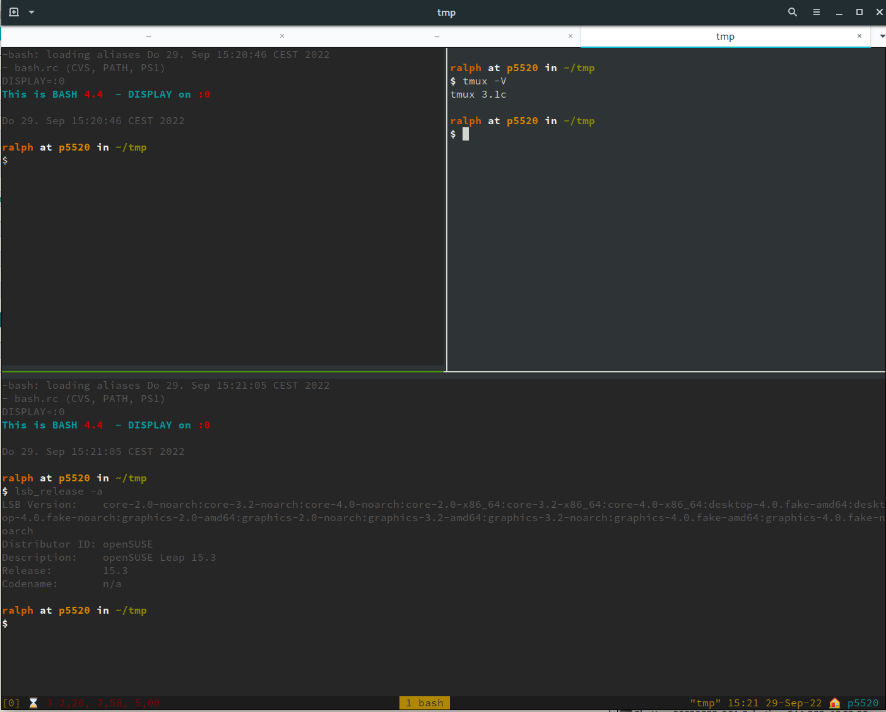
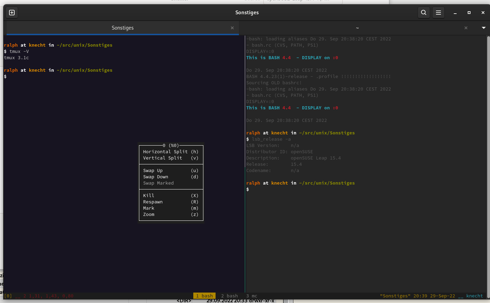

# tmux Example Configuration File

Universal tmux configuration files for multiple distros (SUSE, Debian, Ubuntu etc.)

Tested with x86_64, i686 and ARM64 architectures under Debian 10,11,12 and openSUSE 15.x and SLES 15.x

## Installation

````bash
cp tmux.conf  ~/.tmux.conf
tmux
````

## Features

- Nice status line
- Right click context menu (if mouse support is loaded/graphic terminal)
- multiple windows/screens (Ctrl-B 1..9)
- horizontal and vertical window split
- mouse support

## Screenshots

Example 1


Example 2


<!--
$Id: README.md,v 1.3 2023/07/12 05:18:23 ralph Exp $
vim:set fileencoding=utf8 fileformat=unix filetype=gfm tabstop=2 expandtab:
 -->
